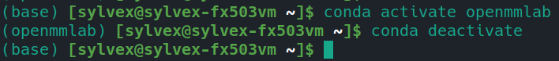
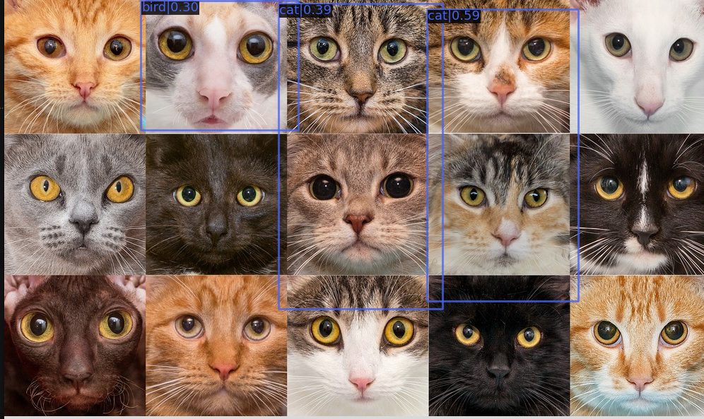

# 安裝openmmlab

## 前言

Openmmlab是將各種電腦圖像辨識演算法做整合的一個框架，可以用統一的接口做各種圖像辨識的演算法的研發、使用和調整。以下會以物件偵測，以openmmlab的mmdetection做說明。

## Python Environment (conda)

1. 安裝 miniconda

請參考 [miniconda](https://docs.conda.io/en/latest/miniconda.html)，這邊建議使用 python 3.8 版本

2. 利用conda建立環境

```bash
conda create -n openmmlab python=3.8 -y
conda activate openmmlab
```


你的終端機應該旁邊會顯示 (openmmlab)

3. 安裝pytorch

請參考 [pytorch](https://pytorch.org/get-started/locally/)和以下指令:
```bash
nvidia-smi
```

確認你的GPU型號，並安裝對應的版本\
如:

```bash
conda install pytorch torchvision torchaudio pytorch-cuda=11.8 -c pytorch -c nvidia
```
版本不對會出事，有在這裡死過。

4. 安裝 mmcv

```bash
pip install -U openmim
mim install mmcv-full
```

5. 安裝 MMDetection

如果想要接下來下面的教學的話，強烈建議以git clone的方式執行，由於訓練、可視化工具、驗證等等都會以mmdetection的repository中的腳本為主。

```
git clone https://github.com/open-mmlab/mmdetection.git
cd mmdetection
pip install -v -e .
```

6. 驗證安裝

下載模型
```bash
mim download mmdet --config yolov3_mobilenetv2_320_300e_coco --dest checkpoints
```
```checkpoints```資料夾會出現兩個檔案
```yolov3_mobilenetv2_320_300e_coco.py``` 和 ```yolov3_mobilenetv2_320_300e_coco_20210719_215349-d18dff72.pth```

執行測試
```bash
python test.py
```

如果成功的話代表你安裝好了。成功的話會出現```result.jpg```，也會跳出視窗：
