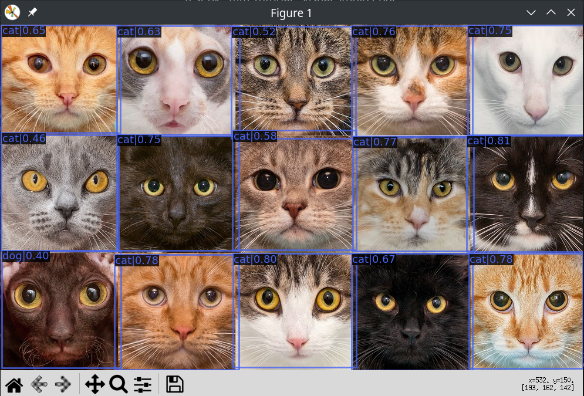

# 更換模型

## model zoo & mim

reference: (https://github.com/open-mmlab/mim/blob/main/README.md)

mim 是一個簡單的工具，可以幫助你快速下載和安裝openmmlab 的模型，作為快速的展示。執行：
```bash
mim download mmdet --config yolox_tiny_8x8_300e_coco --dest checkpoints
```
將會下載yolox tiny的模型至 ```checkpoints``` 資料夾中，會有兩種檔案: ```yolox_tiny_8x8_300e_coco_20211124_171234-b4047906.pth```和```yolox_tiny_8x8_300e_coco.py```檔

1. ```.pth```檔案是模型權重，對應checkpoint_file，基本上就是你訓練出來的物件偵測模型檔案，基本上跟pytorch訓練出來的東西是一樣的。是訓練之後的產物。

2. ```.py```檔案是模型設定檔，對應config_file，基本上就像模型DNA，模型用的演算法是以什麼基底、訓練的行程、訓練時所需要的檔案等等資訊。是訓練之前所需要的設定。

現在可以```test.py```中更換你想要的model了：



(可以看到用yolox的偵測結果好多了)

至於可供下載的model可以參考: [這個連結](https://github.com/open-mmlab/mmdetection/blob/master/docs/en/model_zoo.md)

我個人是點擊任何一個model後，複製其檔名，並將其貼至mim的config參數中，藉此下載別人預先訓練好的模型。