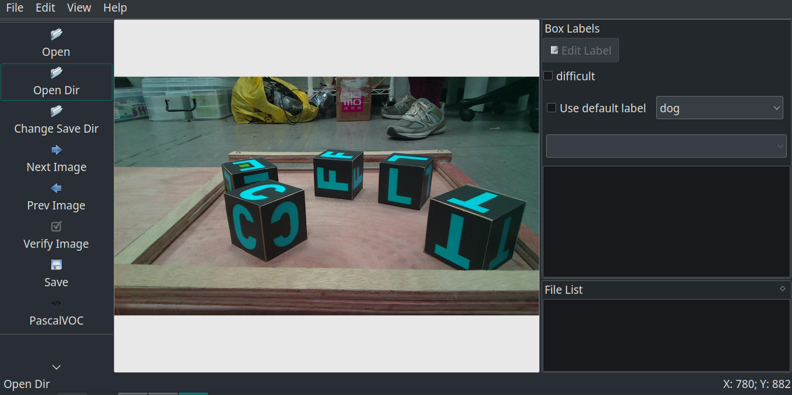

# 自製資料集

有更換過模型之後，現在我們嘗試把自己的模型導入做訓練。

## 匡選資料集

最終目的得到coco格式的資料集，要coco格式之前需要PascalVOC的匡選。因此以下步驟為1. 匡選得到PascalVOC的xml標註檔。2. 轉換到coco格式 3. 訓練

### 1. 得到匡選得到PascalVOC的xml標註檔

這裡建議使用labelimg，記得一定要選擇pascalvoc的格式做匡選。這邊就使用之前比賽的標注檔。就不細說了。
如下圖，以比賽為例就是匡選並標注T, E, L, C, F



框完一個照片之後，會取得一個xml檔，依此類推。

### 2. 轉換到coco格式

如果你之前的檔案是yolo格式，網路上也有yolo轉換成coco格式的專案，這裡就以PascalVOC為例。

參照專案[voc2coco](https://github.com/yukkyo/voc2coco)做PascalVOC的轉換，你會需要三個東西:1. 標注資料夾 2. 標注id 3. 偵測物件的類別名稱（腳本已經在這個專案裡面了）

1. 標注資料夾(--ann_dir)：把你所有的xml檔放進一個資料夾
2. 標注id(--ann_ids)：
3. 偵測物件的類別名稱(--labels):

執行以下指令，產生output.json，路徑參數請根據上述自行更改。
```python voc2coco.py --ann_dir /home/sylvex/train/Annotations --ann_ids /home/sylvex/train/ImageSets/Main/test.txt --labels /home/sylvex/train/labels.txt --output output.json --ext xml```

這個output.json將會做為接下來訓練，設定檔所需要的東西。基本上就是一個你所有照片的標注資料就是了。

### 3. 訓練

見下一章。