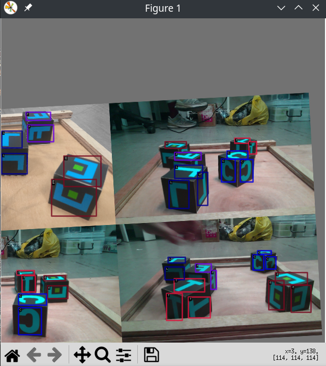
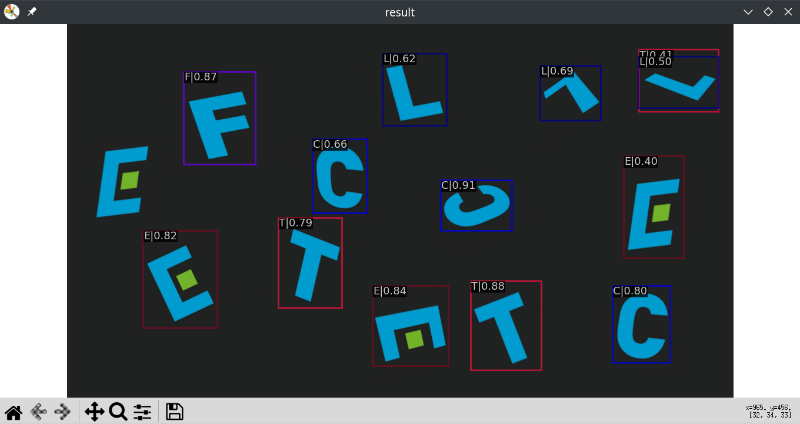

# 訓練

訓練非常簡單，只需要執行mmdetection repo中的train.py就可以執行。而訊練只需要設定檔就可以進行。因此現在要做的就是學會更改設置，以將標注好的資料引入做訓練。

## 取得並更改設定檔

取得模型的設定檔可以使用先前提到的mim下載，剛剛的確下載了一個yolox的設定檔可以直接改，但mim也同時會下載多餘的pretrained model。

基本上最正當的方法是繼承mmdetection/configs裡面的設定，configs中有許多算法，這裡選了faster_rcnn做實現，如下：

```
_base_ = ['mmdetection/configs/faster_rcnn/faster_rcnn_r50_fpn_1x_coco.py']

dataset_type = 'CocoDataset'
classes = ('T', 'E', 'L', 'C', 'F')
img_prefix = '/home/sylvex/train/JPEGImages'
ann_file = '/home/sylvex/train/JPEGImages/output.json'
num_classes=5

data = dict(
    train=dict(
        classes=classes,
        ann_file=ann_file,
        img_prefix=img_prefix),
    val=dict(
        type=dataset_type,
        classes=classes,
        ann_file=ann_file,
        img_prefix=img_prefix),
    test=dict(
        type=dataset_type,
        classes=classes,
        ann_file=ann_file,
        img_prefix=img_prefix))

model = dict(
    roi_head=dict(
        bbox_head=dict(
                type='Shared2FCBBoxHead',
                num_classes=num_classes)))
```

基本上重點只有最前面幾行：
- 先使用```_base_```繼承config中的faster_rcnn的設定
- ```dataset_type = 'CocoDataset'```: 資料集為CocoDataset格式
- ```classes```: 要偵測物件的名稱
- ```img_prefix```: 放自己照片的資料夾
- ```ann_file```: 前面撰換得到的coco格式之標注資料
- ```num_classes```: 偵測物件的數量

以上面宣告變數，然後把算法裡面相對應的東西取代掉即可。

如果去看模型設定實現的時候，會發現只有這樣：
```
_base_ = [
    '../_base_/models/faster_rcnn_r50_fpn.py',
    '../_base_/datasets/coco_detection.py',
    '../_base_/schedules/schedule_1x.py', '../_base_/default_runtime.py'
]
```

可以看到在openmmlab中，一個物件偵測演算法很多都是以模塊化設計，若是想要直接觀看整個演算法在幹麻的話，以下指令可以印出演算法的全貌：

```python mmdetection/tools/misc/print_config.py mmdetection/configs/faster_rcnn/faster_rcnn_r50_fpn_1x_coco.py > ./faster_printed.py```

在本專案的faster_printed.py可以看到藉此印出的整個實作細節：

```
model = dict(
    type='FasterRCNN',
    backbone=dict(
        type='ResNet',
        depth=50,
        num_stages=4,
        out_indices=(0, 1, 2, 3),
        frozen_stages=1,
        norm_cfg=dict(type='BN', requires_grad=True),
        norm_eval=True,
        style='pytorch',
        init_cfg=dict(type='Pretrained', checkpoint='torchvision://resnet50')),
    neck=dict(
        type='FPN',
        in_channels=[256, 512, 1024, 2048],
        out_channels=256,
        num_outs=5),
    rpn_head=dict(
        type='RPNHead',
        in_channels=256,
        feat_channels=256,
        anchor_generator=dict(
            type='AnchorGenerator',
            scales=[8],
            ratios=[0.5, 1.0, 2.0],
            strides=[4, 8, 16, 32, 64]),
        bbox_coder=dict(
            type='DeltaXYWHBBoxCoder',
            target_means=[0.0, 0.0, 0.0, 0.0],
            target_stds=[1.0, 1.0, 1.0, 1.0]),
        loss_cls=dict(
            type='CrossEntropyLoss', use_sigmoid=True, loss_weight=1.0),
        loss_bbox=dict(type='L1Loss', loss_weight=1.0)),
    roi_head=dict(
        type='StandardRoIHead',
        bbox_roi_extractor=dict(
            type='SingleRoIExtractor',
            roi_layer=dict(type='RoIAlign', output_size=7, sampling_ratio=0),
            out_channels=256,
            featmap_strides=[4, 8, 16, 32]),
        bbox_head=dict(
            type='Shared2FCBBoxHead',
            in_channels=256,
            fc_out_channels=1024,
            roi_feat_size=7,
            num_classes=80,
            bbox_coder=dict(
                type='DeltaXYWHBBoxCoder',
                target_means=[0.0, 0.0, 0.0, 0.0],
                target_stds=[0.1, 0.1, 0.2, 0.2]),
            reg_class_agnostic=False,
            loss_cls=dict(
                type='CrossEntropyLoss', use_sigmoid=False, loss_weight=1.0),
            loss_bbox=dict(type='L1Loss', loss_weight=1.0))),
    train_cfg=dict(
        rpn=dict(
            assigner=dict(
                type='MaxIoUAssigner',
                pos_iou_thr=0.7,
                neg_iou_thr=0.3,
                min_pos_iou=0.3,
                match_low_quality=True,
                ignore_iof_thr=-1),
            sampler=dict(
                type='RandomSampler',
                num=256,
                pos_fraction=0.5,
                neg_pos_ub=-1,
                add_gt_as_proposals=False),
            allowed_border=-1,
            pos_weight=-1,
            debug=False),
        rpn_proposal=dict(
            nms_pre=2000,
            max_per_img=1000,
            nms=dict(type='nms', iou_threshold=0.7),
            min_bbox_size=0),
        rcnn=dict(
            assigner=dict(
                type='MaxIoUAssigner',
                pos_iou_thr=0.5,
                neg_iou_thr=0.5,
                min_pos_iou=0.5,
                match_low_quality=False,
                ignore_iof_thr=-1),
            sampler=dict(
                type='RandomSampler',
                num=512,
                pos_fraction=0.25,
                neg_pos_ub=-1,
                add_gt_as_proposals=True),
            pos_weight=-1,
            debug=False)),
    test_cfg=dict(
        rpn=dict(
            nms_pre=1000,
            max_per_img=1000,
            nms=dict(type='nms', iou_threshold=0.7),
            min_bbox_size=0),
        rcnn=dict(
            score_thr=0.05,
            nms=dict(type='nms', iou_threshold=0.5),
            max_per_img=100)))
dataset_type = 'CocoDataset'
data_root = 'data/coco/'
img_norm_cfg = dict(
    mean=[123.675, 116.28, 103.53], std=[58.395, 57.12, 57.375], to_rgb=True)
train_pipeline = [
    dict(type='LoadImageFromFile'),
    dict(type='LoadAnnotations', with_bbox=True),
    dict(type='Resize', img_scale=(1333, 800), keep_ratio=True),
    dict(type='RandomFlip', flip_ratio=0.5),
    dict(
        type='Normalize',
        mean=[123.675, 116.28, 103.53],
        std=[58.395, 57.12, 57.375],
        to_rgb=True),
    dict(type='Pad', size_divisor=32),
    dict(type='DefaultFormatBundle'),
    dict(type='Collect', keys=['img', 'gt_bboxes', 'gt_labels'])
]
test_pipeline = [
    dict(type='LoadImageFromFile'),
    dict(
        type='MultiScaleFlipAug',
        img_scale=(1333, 800),
        flip=False,
        transforms=[
            dict(type='Resize', keep_ratio=True),
            dict(type='RandomFlip'),
            dict(
                type='Normalize',
                mean=[123.675, 116.28, 103.53],
                std=[58.395, 57.12, 57.375],
                to_rgb=True),
            dict(type='Pad', size_divisor=32),
            dict(type='ImageToTensor', keys=['img']),
            dict(type='Collect', keys=['img'])
        ])
]
data = dict(
    samples_per_gpu=2,
    workers_per_gpu=2,
    train=dict(
        type='CocoDataset',
        ann_file='data/coco/annotations/instances_train2017.json',
        img_prefix='data/coco/train2017/',
        pipeline=[
            dict(type='LoadImageFromFile'),
            dict(type='LoadAnnotations', with_bbox=True),
            dict(type='Resize', img_scale=(1333, 800), keep_ratio=True),
            dict(type='RandomFlip', flip_ratio=0.5),
            dict(
                type='Normalize',
                mean=[123.675, 116.28, 103.53],
                std=[58.395, 57.12, 57.375],
                to_rgb=True),
            dict(type='Pad', size_divisor=32),
            dict(type='DefaultFormatBundle'),
            dict(type='Collect', keys=['img', 'gt_bboxes', 'gt_labels'])
        ]),
    val=dict(
        type='CocoDataset',
        ann_file='data/coco/annotations/instances_val2017.json',
        img_prefix='data/coco/val2017/',
        pipeline=[
            dict(type='LoadImageFromFile'),
            dict(
                type='MultiScaleFlipAug',
                img_scale=(1333, 800),
                flip=False,
                transforms=[
                    dict(type='Resize', keep_ratio=True),
                    dict(type='RandomFlip'),
                    dict(
                        type='Normalize',
                        mean=[123.675, 116.28, 103.53],
                        std=[58.395, 57.12, 57.375],
                        to_rgb=True),
                    dict(type='Pad', size_divisor=32),
                    dict(type='ImageToTensor', keys=['img']),
                    dict(type='Collect', keys=['img'])
                ])
        ]),
    test=dict(
        type='CocoDataset',
        ann_file='data/coco/annotations/instances_val2017.json',
        img_prefix='data/coco/val2017/',
        pipeline=[
            dict(type='LoadImageFromFile'),
            dict(
                type='MultiScaleFlipAug',
                img_scale=(1333, 800),
                flip=False,
                transforms=[
                    dict(type='Resize', keep_ratio=True),
                    dict(type='RandomFlip'),
                    dict(
                        type='Normalize',
                        mean=[123.675, 116.28, 103.53],
                        std=[58.395, 57.12, 57.375],
                        to_rgb=True),
                    dict(type='Pad', size_divisor=32),
                    dict(type='ImageToTensor', keys=['img']),
                    dict(type='Collect', keys=['img'])
                ])
        ]))
evaluation = dict(interval=1, metric='bbox')
optimizer = dict(type='SGD', lr=0.02, momentum=0.9, weight_decay=0.0001)
optimizer_config = dict(grad_clip=None)
lr_config = dict(
    policy='step',
    warmup='linear',
    warmup_iters=500,
    warmup_ratio=0.001,
    step=[8, 11])
runner = dict(type='EpochBasedRunner', max_epochs=12)
checkpoint_config = dict(interval=1)
log_config = dict(interval=50, hooks=[dict(type='TextLoggerHook')])
custom_hooks = [dict(type='NumClassCheckHook')]
dist_params = dict(backend='nccl')
log_level = 'INFO'
load_from = None
resume_from = None
workflow = [('train', 1)]
opencv_num_threads = 0
mp_start_method = 'fork'
auto_scale_lr = dict(enable=False, base_batch_size=16)
```

用上面展開的結果照著上述拿來改，也是可以訓練的，記得第一行的config要拿掉。

從上面完整的模型設定實現來看，可以看到fasterRCNN是以resnet作為模型的backbone，中間有經過FPN(feature pyramid network),在訓練的過程中會做resize、隨機翻轉、padding等等transform、也可以調整gpu的負載、batch_size和學習率等等。如果對於物件偵測的演算法較為熟悉的話，要做架構上的調整似乎也是可以的。

然後訓練只要下這行指令就好，train後面放你的設定檔的路徑：

```python mmdetection/tools/train.py faster.py```

然後就開始訓練了。

在訓練的過程中，會創建一個```work_dir```的資料夾，裡面會出現相對應設定檔中的訓練的log，訓練期間暫時的訓練權重等等。

（然後我電腦效能不夠，跑完第一個epoch就當機了...)

基本上我目前成功跑起來的模型是yolox，其他的算法嘗試自己修最後也是不太行，推估蠻大的可能是自己電腦的效能不足，或是某一些模型的設定檔需要以分散式訓練才能繼續訓練（github issue上有看到這件事情），就針對自己成功的案例繼續下去吧。

## 其他

### 確認資料集

在訓練之前可以觀看自己設定檔的dataset是否正確：

```python mmdetection/tools/misc/browse_dataset.py yolox.py --show-interval 10```

如果有成功跑出框框，那就代表你的資料集大致沒有問題。



值得一提的是，在yolox裡面，會對資料做隨機擴充，而在這裡也會反映出來。

### 接續

如果電腦跑到一半當機，可以在產生的```work_dir中接續之前的訓練：

```python mmdetection/tools/train.py yolox.py --resume-from work_dirs/yolox/epoch_120.pth```

### 測試

測試precision和recall:

```python mmdetection/tools/test.py work_dirs/yolox/yolox.py work_dirs/yolox//latest.pth --eval bbox```

結果：

```
Evaluating bbox...
Loading and preparing results...
DONE (t=0.08s)
creating index...
index created!
Running per image evaluation...
Evaluate annotation type *bbox*
DONE (t=0.93s).
Accumulating evaluation results...
DONE (t=0.19s).

 Average Precision  (AP) @[ IoU=0.50:0.95 | area=   all | maxDets=100 ] = 0.808
 Average Precision  (AP) @[ IoU=0.50      | area=   all | maxDets=1000 ] = 0.995
 Average Precision  (AP) @[ IoU=0.75      | area=   all | maxDets=1000 ] = 0.975
 Average Precision  (AP) @[ IoU=0.50:0.95 | area= small | maxDets=1000 ] = -1.000
 Average Precision  (AP) @[ IoU=0.50:0.95 | area=medium | maxDets=1000 ] = 0.791
 Average Precision  (AP) @[ IoU=0.50:0.95 | area= large | maxDets=1000 ] = 0.823
 Average Recall     (AR) @[ IoU=0.50:0.95 | area=   all | maxDets=100 ] = 0.842
 Average Recall     (AR) @[ IoU=0.50:0.95 | area=   all | maxDets=300 ] = 0.842
 Average Recall     (AR) @[ IoU=0.50:0.95 | area=   all | maxDets=1000 ] = 0.842
 Average Recall     (AR) @[ IoU=0.50:0.95 | area= small | maxDets=1000 ] = -1.000
 Average Recall     (AR) @[ IoU=0.50:0.95 | area=medium | maxDets=1000 ] = 0.829
 Average Recall     (AR) @[ IoU=0.50:0.95 | area= large | maxDets=1000 ] = 0.855

OrderedDict([('bbox_mAP', 0.808), ('bbox_mAP_50', 0.995), ('bbox_mAP_75', 0.975), ('bbox_mAP_s', -1.0), ('bbox_mAP_m', 0.791), ('bbox_mAP_l', 0.823), ('bbox_mAP_copypaste', '0.808 0.995 0.975 -1.000 0.791 0.823')])
```

### 推理

```python mmdetection/demo/image_demo.py ~/Desktop/simulate.png yolox.py work_dirs/yolox/latest.pth```

